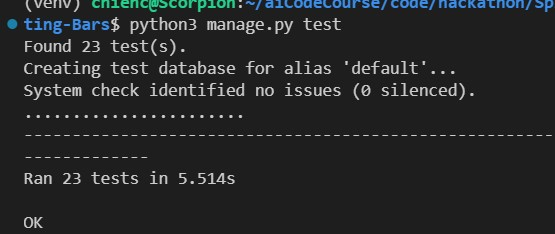
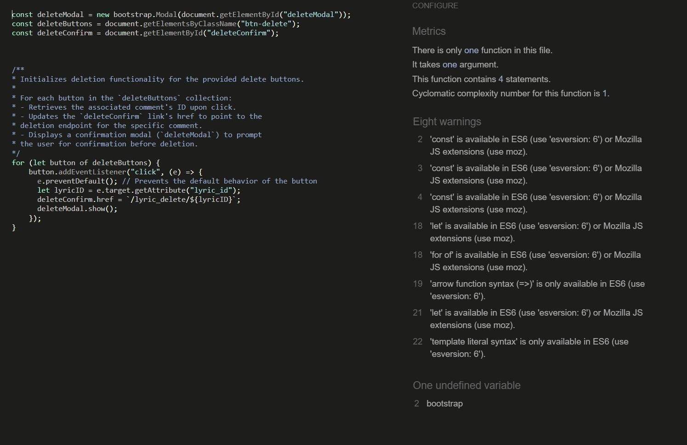

# Spittin' Bars
test
## Table of Contents
- [Introduction](#introduction)
- [Overview](#overview)
- [UX - User Experience](#ux---user-experience)
  - [Design Inspiration](#design-inspiration)
  - [Colour Scheme](#colour-scheme)
  - [Font](#font)
  - [Project Planning](#project-planning)
- [Strategy Plane](#strategy-plane)
  - [Site Goals](#site-goals)
  - [Agile Methodologies - Project Management](#agile-methodologies---project-management)
  - [MoSCoW Prioritization](#moscow-prioritization)
  - [Sprints](#sprints)
  - [User Stories](#user-stories)
    - [Visitor User Stories](#visitor-user-stories)
    - [Epic - User Profile](#epic---user-profile)
    - [Epic - Articles](#epic---articles)
    - [Epic - Booking](#epic---booking)
    - [Epic - Photo Gallery](#epic---photo-gallery)
    - [Epic - Visit Us/Reviews](#epic---visit-usreviews)
- [Scope Plane](#scope-plane)
- [Structural Plane](#structural-plane)
- [Skeleton & Surface Planes](#skeleton--surface-planes)
  - [Wireframes](#wireframes)
- [Database Schema - Entity Relationship Diagram](#database-schema---entity-relationship-diagram)
- [Security](#security)
- [Features](#features)
  - [User View - Registered/Unregistered](#user-view---registeredunregistered)
  - [CRUD Functionality](#crud-functionality)
  - [Feature Showcase](#feature-showcase)
  - [Future Features](#future-features)
- [Technologies & Languages Used](#technologies--languages-used)
- [Libraries & Frameworks](#libraries--frameworks)
- [Tools & Programs](#tools--programs)
- [Testing](#testing)
- [Deployment](#deployment)
  - [Connecting to GitHub](#connecting-to-github)
  - [Django Project Setup](#django-project-setup)
  - [Cloudinary API](#cloudinary-api)
  - [Elephant SQL](#elephant-sql)
  - [Heroku Deployment](#heroku-deployment)
  - [Clone Project](#clone-project)
  - [Fork Project](#fork-project)
- [Credits](#credits)
  - [Code](#code)
  - [Media](#media)
  - [Additional Reading/Tutorials/Books/Blogs](#additional-readingtutorialsbooksblogs)
- [Acknowledgements](#acknowledgements)

### Introduction

Spittin' Bars is a platform tailored for aspiring rappers, poets, and lyricists. It offers a space to compose and refine lyrics, allowing users to hone their craft and share their work with a community of like-minded individuals.

### Target Audience

Our app is a haven for creative writers, whether you're a rapper, songwriter, poet, or simply someone who loves the art of words. Imagine a platform that's not only quick and easy to use but also packed with features to fuel your creativity. Dive into a world of backing tracks that spark inspiration and provide the perfect practice environment. Save your masterpieces for personal reflection or share them with a vibrant community eager to celebrate your talent. Whether you're recording, performing live, or memorizing your verses, our app is your ultimate companion, empowering you to elevate your craft and connect with fellow wordsmiths.

### UX - User Experience

* Design Inspiration

Branding, which will also be the basis of our colour scheme to maintain conformity.


* Colour Scheme
* Font
* Project Planning


<hr>

### User Stories

* As a user, I want to create and save my own lyrics, so that I can share them with friends and get feedback.

* As a user, I want to read and view my saved lyrics, so that I can review my work anytime.

* As a user, I want to update my lyrics, so that I can make improvements and changes.

* As a user, I want to delete my lyrics, so that I can remove any unwanted content.

* As a user, I want to browse other users' lyrics, so that I can get inspired and learn from others.

* As a user, I want to rate and comment on other users' lyrics, so that I can provide feedback and engage with the community.

* As a user, I want to search for lyrics by genre or theme, so that I can find content that matches my interests.

* As a user, I want to record and playback my lyrics, so that I can hear how they sound and make improvements.

## Admin User Stories

* As an admin, I want to manage user accounts, so that I can create, update, or delete accounts to maintain the integrity of the community.

* As an admin, I want to approve or reject new lyric submissions for public display, so that I can ensure the content meets the community guidelines.

* As an admin, I want to monitor user activity and comments, so that I can manage inappropriate behavior and maintain a positive environment.

* As an admin, I want to generate reports on user engagement and content popularity, so that I can assess the app's performance and make data-driven decisions.

* As an admin, I want to manage site settings and configurations, so that I can update the platform as needed.

## MoSCoW Prioritization

### Must Have: Essential features that the app cannot function without.

* User: Manage an account - register, sign in log out

* User: Creating, reading, updating, and deleting lyrics

* User: Playback backing track (looped beat various styles) functionality to practice to work in my lyrics and practice

* User: Browsing and viewing other users' lyrics

* Admin: Managing user accounts

* Admin: Managing user activity

* Admin: Approving or rejecting new lyrics submissions to public area

### Should Have: Important features that are not critical but highly valuable.

* User: Rating and commenting on lyrics

* User: Searching for lyrics by genre or theme

* Admin: Monitoring user activity and comments

### Could Have: Desirable features that are not necessary but would enhance the user experience.

* User: Searching for lyrics by genre or theme

* User: links to other media

* Admin: Generating reports on user engagement and content popularity

### Won't Have: Features that are not planned for the current version of the app.

* Advanced editing tools (e.g., recording, auto-tune, beat matching)

<hr>

### Wireframes
The wireframes were created using Balsamiq
Homepage (unregistered users):

Homepage Registered Logged In Users:

Community Page:


### Database Schema - Entity Relationship Diagram

### Genre 

| **Field**    | **Type**                    | **Description**                                    |
|--------------|-----------------------------|----------------------------------------------------|
| `name`       | CharField(max_length=150)   | Unique identifier for each user.                   |

## Lyric Model

 **Field**      | **Type**                    | **Description**                                  |
|---------------|-----------------------------|--------------------------------------------------|
| `artist`      | ForeignKey(User)            | Represents a logged in user                      |
| `title`       | CharField(max_length=150)   | The title of the lyrics.                         |
| `Lyric`       | TextField                   | The lyrics content.                              |
| `status`      | IntegerField(default=0)     | personal or submit for publication               |
| `admin_accept`| BooleanField(default=False) | Whether the lyrics are published (True/False).   |
| `created_at`  | DateTimeField(auto_now=True)| Timestamp for when the lyrics were created.      |
| `updated_at`  | DateTimeField(auto_now=True)| Timestamp for when the lyrics were last updated. |


## Entity Realtionship Models
```
+------------+         +------------+
|   Genre    |         |   Lyrics   |
|------------|         |------------|
| name       |         | title      |
|            |         | artist     |
|            |---------| lyric      |
|            |         | status     |
|            |         | adminaccept|
|            |         | created_at |
|            |         | updated_at |
+------------+         +------------+
```

## Realtionship

One-to-Many: Each user can have multiple lyrics, but each piece of lyrics belongs to one user. This is represented by the foreign key author_id in the Lyrics table.

## Testing


### Feature-by-Feature Testing:

- Navigation:
Testested for smooth transitions between pages, links directing to the correct destinations.
- Responsive Design: 
Checked for compatibility across various devices and screen sizes.

- Lyrics Display: 
Lyrics are properly showcased with accurate descriptions and links.

- All Forms: 
Tested the form submission process, ensuring the user receives a confirmation.

### User Experience Testing:

- Usability Testing: 
The current implementation has meet the goal setup, all forms are functioning as expected, the logic meet design scope and user stories' requirements.  

- Accessibility Testing: 
All images and links have well labeled alt text for screen reader compatibility compliance.

### Compatibility Testing:

- Browser Compatibility: 
Testing applied on different browsers (Chrome, Firefox, Microsoft Edge,) to ensure consistent performance.

- Device Compatibility:

Functionality tested across various devices (desktops, laptops, tablets, and mobile phones).

## Code Validation

### HTML


### CSS 


### Python

I have used the recommended [PEP8 CI Python Linter](https://pep8ci.herokuapp.com) to validate all of my Python files.


| APP | File | CI URL |
| --- | --- | --- |
| lyric_app | admin.py | [PEP8 CI](https://pep8ci.herokuapp.com/https://raw.githubusercontent.com/NickOcaz/Spitting-Bars/refs/heads/main/lyric_app/admin.py) | 
| lyric_app | forms.py | [PEP8 CI](https://pep8ci.herokuapp.com/https://raw.githubusercontent.com/NickOcaz/Spitting-Bars/refs/heads/main/lyric_app/forms.py) | 
| lyric_app | models.py | [PEP8 CI](https://pep8ci.herokuapp.com/https://raw.githubusercontent.com/NickOcaz/Spitting-Bars/refs/heads/main/lyric_app/models.py) | 
| lyric_app | urls.py | [PEP8 CI](https://pep8ci.herokuapp.com/https://raw.githubusercontent.com/NickOcaz/Spitting-Bars/refs/heads/main/lyric_app/urls.py)  | 
| lyric_app | views.py | [PEP8 CI](https://pep8ci.herokuapp.com/https://raw.githubusercontent.com/NickOcaz/Spitting-Bars/refs/heads/main/lyric_app/vies.py) | 


### Unit test

| APP | File | CI URL |
| --- | --- | --- |
| lyric_app | test_models.py | [PEP8 CI](https://pep8ci.herokuapp.com/https://raw.githubusercontent.com/NickOcaz/Spitting-Bars/refs/heads/main/lyric_app/test_models.py) | 
| lyric_app | test_forms.py | [PEP8 CI](https://pep8ci.herokuapp.com/https://raw.githubusercontent.com/NickOcaz/Spitting-Bars/refs/heads/main/lyric_app/test_forms.py) | 
| lyric_app | test_views.py | [PEP8 CI](https://pep8ci.herokuapp.com/https://raw.githubusercontent.com/NickOcaz/Spitting-Bars/refs/heads/main/lyric_app/test_views.py) | 





### Javascript
I have validated all my js files on [javascript validator](jshint.com) give some warnings about ES6 version syntax on them. 


## Browser Compatibility

I've tested my deployed project on multiple browsers to check for compatibility issues.

| Browser |  |  |  |  | Notes |
| --- | --- | --- | --- | --- | --- |
| Chrome |   Works as expected |
| Firefox |   Works as expected |
| Microsoft Edge|   Works as expected |

## Responsiveness

I've tested my deployed project on multiple devices to check for responsiveness issues.

|  |  |  | Notes |
| --- | --- | --- | --- |
| Mobile (DevTools) |  | Works as expected |
| Tablet (DevTools) |  | Works as expected |
| Desktop |  | Works as expected |

## Deployment

* Connecting to GitHub

Repository initially created on GitHub, Here's how

1. Sign in to GitHub First, go to GitHub and log in to your account. If you don't have an account, you'll need to sign up.

2. Create a New Repository Once you're logged in, click the + icon in the top-right corner of the page, and select New repository.

You’ll be taken to the Create a new repository page.

3. Set Up the Repository Repository name: Choose a name for your repository.

Description (optional): You can add a brief description of your project.

Public or Private: Select whether you want the repository to be public (visible to everyone) or private (only you and selected collaborators can see it). This project is set to public

Initialize this repository with a README: (2) It's often a good idea to check this box. It will create a README.md file in your repository, which you can edit to describe your project.

Now Create repository (3).


4. Open the GitHub Repository Navigate to your GitHub repository in your web browser and copy the link for your repository.


5. Launch Gitpod and select New Workspace


6. Here you can paste the url to the repositry and select your chosen editor.


7. Now that the repo is open in our editor any addition to the code are submitted to the repo in the terminal with the commands

git add . git commit -m "Initial commit" (details of commit)

git push

8. Each team member created their own branch to work on, which was later merged with the main branch to avoid conflicts.

### Creating a Branch from Main

To create a new branch from the main branch, follow these steps:

1. Open your terminal or command prompt.
2. Navigate to your project directory.
3. Ensure you are on the main branch by running:
  ```bash
  git checkout main
  ```
4. Create a new branch with a descriptive name:
  ```bash
  git checkout -b new-branch-name
  ```
5. Your new branch is now created, and you can start making changes without affecting the main branch.

* Heroku Deployment

1. Create a New App on Heroku:

* Go to Heroku and log in.
* Click the "New" button in the top right corner and select "Create new app".
* Enter a unique name for your app and choose your region.
* Click "Create app".


2. In settings Connect to GitHub repo, search can be used to ensure your Heroku is connected to GitHub:


3. In settings, set config vars to replicate what is in env.py, secret key and database_url-


4. Manual deploy on heroku - heroku-deploy.png


## Credits

- [Code Institute: Blog project as foundation of this project] 
- [CI Blog](https://github.com/Code-Institute-Solutions/blog.git)

### Content

 - [Codepilot](https://copilot.microsoft.com/)
 - [Microsoft Designer](https://designer.microsoft.com/)

| Source | Location | Notes | 
| --- | --- | --- |
| [Shar-nm](https://github.com/shar-nm/lens-whisperer?tab=readme-ov-file) | README and Testing | a wonderful robust template to help me complete this readme.MD file |
| [Very Academy](https://www.youtube.com/watch?v=qJUgC4T5e_E) | Youtube channel | The channel offers vast of Django projects model orm videos |
| [W3Schools](https://www.w3schools.com/howto/howto_js_topnav_responsive.asp) | entire site | responsive HTML/CSS/JS navbar |
| [WhiteNoise](http://whitenoise.evans.io) | entire site | hosting static files on Heroku temporarily |
| [Bootstrap 5.3](https://getbootstrap.com/docs/5.3/getting-started/) | entire site | responsivenes and CSS |

* Code

* Media

* Additional Reading/Tutorials/Books/Blogs

* Acknowledgements
